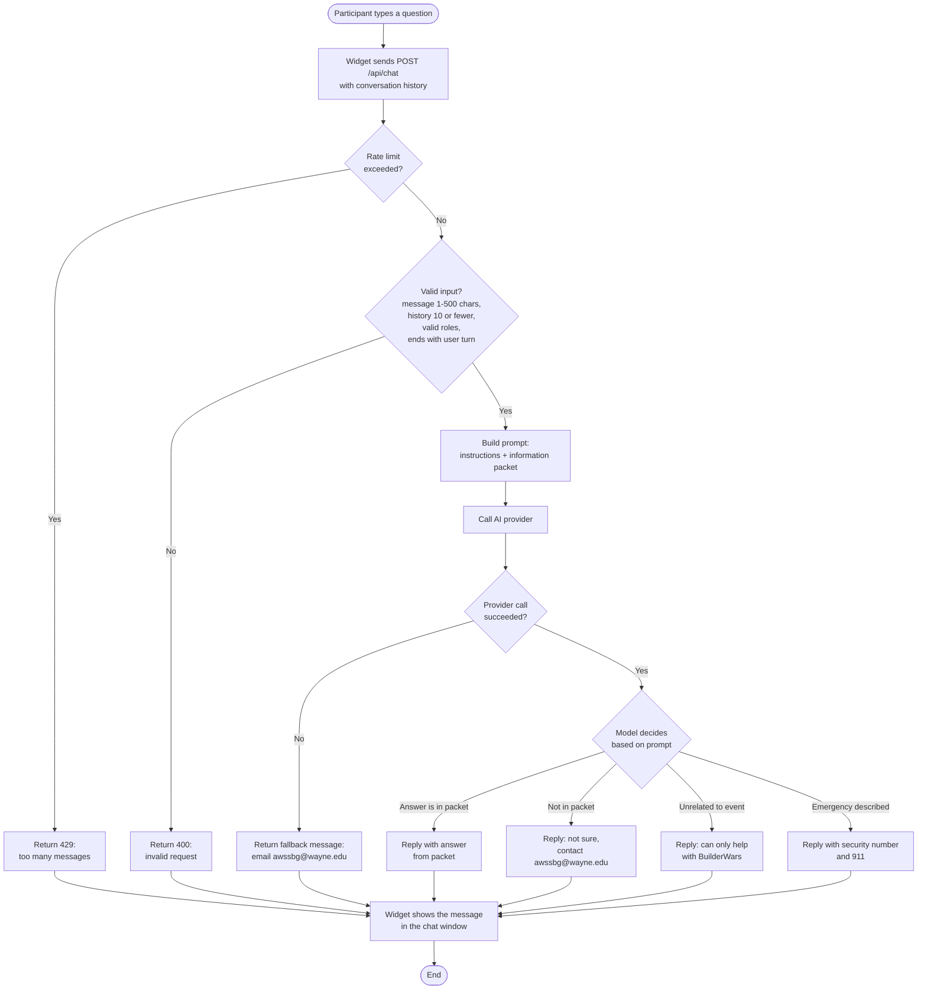

# FAQ Chatbot: Activity Diagram (FR-20)

```mermaid
flowchart TD
    A([Participant types a question]) --> B[Widget sends POST /api/chat<br/>with conversation history]
    B --> C{Rate limit<br/>exceeded?}
    C -- Yes --> C1[Return 429:<br/>too many messages]
    C -- No --> D{Valid input?<br/>message 1-500 chars,<br/>history 10 or fewer,<br/>valid roles,<br/>ends with user turn}
    D -- No --> D1[Return 400:<br/>invalid request]
    D -- Yes --> E[Build prompt:<br/>instructions + information packet]
    E --> F[Call AI provider]
    F --> G{Provider call<br/>succeeded?}
    G -- No --> G1[Return fallback message:<br/>email awssbg@wayne.edu]
    G -- Yes --> H{Model decides<br/>based on prompt}
    H -- Answer is in packet --> H1[Reply with answer<br/>from packet]
    H -- Not in packet --> H2[Reply: not sure,<br/>contact awssbg@wayne.edu]
    H -- Unrelated to event --> H3[Reply: can only help<br/>with BuilderWars]
    H -- Emergency described --> H4[Reply with security number<br/>and 911]
    C1 --> Z
    D1 --> Z
    G1 --> Z
    H1 --> Z
    H2 --> Z
    H3 --> Z
    H4 --> Z
    Z[Widget shows the message<br/>in the chat window] --> Y([End])
```
